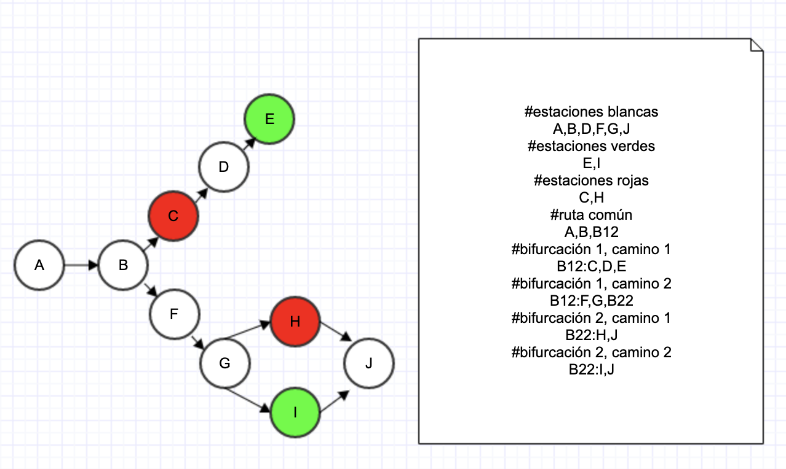

# Metro
rutas óptimas para redes del metro

## Ejecución
```ruby
ruby metro.rb "inputs/input.txt" "A" "F" "R"
```
* El primer parámetro es la ruta del archivo (inputs/input.txt)
* El segundo parámetro es la estación inicial (A)
* El tercer parámetro es la estación de destino (F)
* El cuarto parámetro es opcional e indica el color del tren (R es rojo). Si no va parámetro, se asume blanco

## Representación de rutas
* Cada tipo de dato debe ir en una determinada fila
* Los comentarios no cuentan como filas
* Para hacer comentarios se debe anteponer "#"
* Tipos por filas:
  * **Fila 1**: estaciones de color blanco. Deben ir separadas por coma. Por ejemplo: A,B,C,D,E,F
  * **Fila 2**: estaciones color verde. Deben ir separadas por coma. Por ejemplo: G,I
  * **Fila 3**: estaciones color rojo. Deben ir separadas por coma. Por ejemplo: H
  * **Fila 4**: la ruta base. Representa el principio común del camino. Existen estaciones y **bifurcaciones**. Se representan de la siguiente manera: A,B,B12. Lo anterior significa que se tiene la estación A, B y luego una bifurcación:
    * Estaciones: se representan separadas por coma. Por ejemplo: A,B,C
    * Bifurcaciones: se representan, igual que las estaciones, pero tienen la siguiente sintaxis: B<número-de-bifurcación><número-de-caminos>. Por ejemplo: B12 (Primera bifurcación que tiene 2 caminos)
  * **Fila 5..n**: de aquí hacia adelante van las bifurcaciones en orden, con la sintaxis: B<número-de-bifurcación><número-de-caminos>: ruta. Por ejemplo: B12:D,E,F. Sería lo que representaría un camino para la primera bifurcación.

## Archivo de ruta de ejemplo
### Ejemplo del enunciado

```
#estaciones blancas
A,B,C,D,E,F
#estaciones verdes
G,I
#estaciones rojas
H
#ruta común
A,B,C,B12
#bifurcación 1, camino 1
B12:D,E,F
#bifurcación 1, camino 2
B12:G,H,I,F
```
### Ejemplo con más bifurcaciones

```
#estaciones blancas
A,B,D,F,G,J
#estaciones verdes
E,I
#estaciones rojas
C,H
#ruta común
A,B,B12
#bifurcación 1, camino 1
B12:C,D,E
#bifurcación 1, camino 2
B12:F,G,B22
#bifurcación 2, camino 1
B22:H,J
#bifurcación 2, camino 2
B22:I,J
```